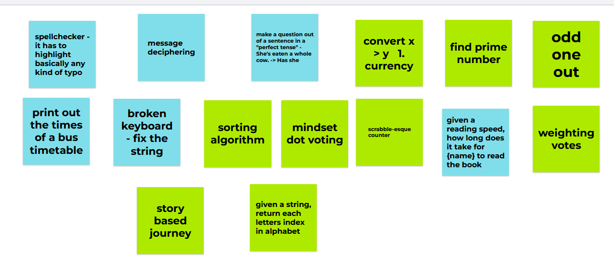

## A team-based approach to development

### team members

Jake  
Peter  
Catherine

### Our Approach & Evaluation

**Starting point:** We agreed to start at 9am with our planning and one MVP completed.  
**Check-ins:** We agreed to have group check-ins every 15 minutes.  
**5-min rule:** We set a rule that anyone stuck on something for more than 5 mins should bring the whole team onboard to help with problem solving.

## Brainstorming

As a team we brainstormed various ideas and discussed each one to guage how feasible it would be to implement them within the given timeframe. Our discussions also considered the adaptability of the idea, in order to plan for clear MVPs and tests.

## Planning

I planned on making the initial tests as simple as possible. Following the TDD approach I wrote a test that failed followed by the code to make it pass. I used this pattern for as many test cases as I could think of. Once the tests were in place, I went back through and refactored the code the best I could.

## Final Results

The Kata is a simple idea and fairly easy to test/solve. The tests implemented work and most edge cases are tested for. With more time, I would like to have tested more, gained more feedback and applied even more strenuous tests.
